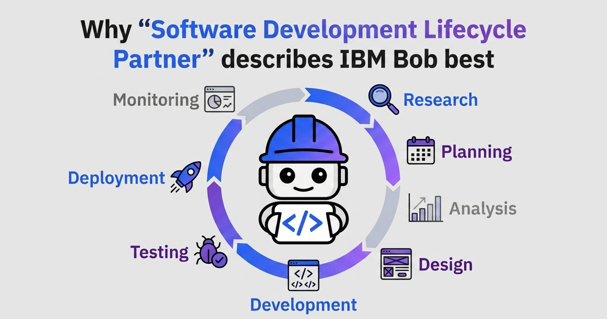

# IBM Bob Skill: Cassandra

A Bob skill that turns any conversation about Apache Cassandra into an expert-guided session.
It covers the three core areas of Cassandra work: schema design, CQL queries, and cluster operations.

---

## About Bob

[Bob](https://bob.ibm.com/) is an AI-powered developer assistant by IBM for the full **SDLC**. Skills extend Bob with domain-specific expertise —
this one adds deep **Cassandra** knowledge to every conversation.



---

## About the Skill

| Area | What you get |
|---|---|
| **Schema & Data Modelling** | Query-driven design workflow — elicits access patterns, recommends partition keys and clustering columns, validates against common pitfalls, and outputs annotated `CREATE TABLE` CQL. |
| **CQL Query Writing & Optimisation** | Writes and optimises SELECT / INSERT / UPDATE / DELETE / BATCH statements, runs a 6-point optimisation checklist, and calls out anti-patterns like full-table scans and `ALLOW FILTERING`. |
| **Operations & Administration** | Cluster setup checklist, compaction strategy selection (STCS / LCS / TWCS), repair scheduling guidance, failure-diagnosis table, and a nodetool command reference. |


---

## Activation

The skill activates automatically whenever the conversation is about Cassandra — no explicit
command needed. You can also invoke it explicitly with:

```
/cassandra
```

---

## Files

```
.bob/skills/cassandra/
  SKILL.md      ← skill instructions loaded by Bob at activation
```

---

## Skill highlights

### Schema & Data Modelling
- Starts from **access patterns**, not relational entities.
- Warns on unbounded partitions, high/low cardinality keys, and tombstone-heavy designs.
- Recognises common patterns: time-series bucketing, fan-out tables, lookup tables, counter tables.

### CQL
- Applies keyspace qualification, paging, consistency-level advice, and prepared-statement reminders.
- Flags: full-table scans, large `IN` clauses, read-before-write, secondary indexes on high-cardinality columns.
- Explains `LOGGED` vs `UNLOGGED BATCH` trade-offs and Paxos overhead for lightweight transactions.

### Operations
- Production setup defaults: `GossipingPropertyFileSnitch`, RF=3, 16 vnodes, G1GC, `vm.swappiness=1`.
- Compaction strategy guide: STCS (write-heavy) · LCS (read-heavy) · TWCS (time-series).
- Repair: incremental vs full, `gc_grace_seconds` cadence, Cassandra Reaper recommendation.
- Failure diagnosis table covering read/write timeouts, node-down, tombstone warnings, and `ALLOW FILTERING` in production.

---

## Requirements

- Bob (any version that supports `.bob/skills/`)
- No external tools or scripts required — the skill is purely instructional.

---

## Scope

This skill is **workspace-scoped** when stored  in your project directory [`.bob/skills/cassandra/`](.bob/skills/cassandra/).
To make it global, move the directory to `~/.bob/skills/cassandra/`.
